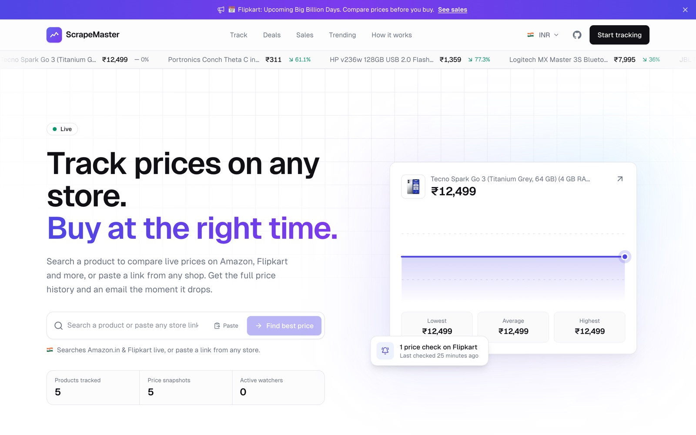
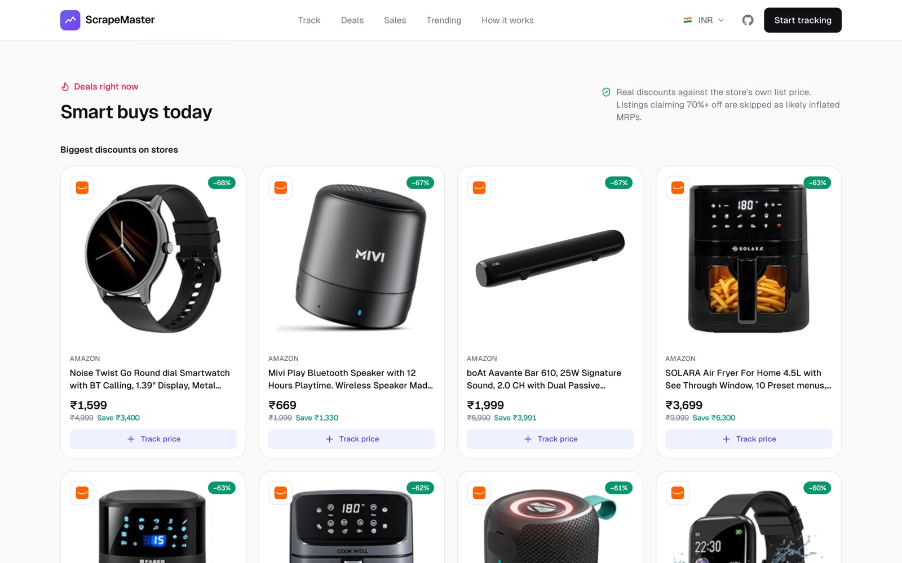
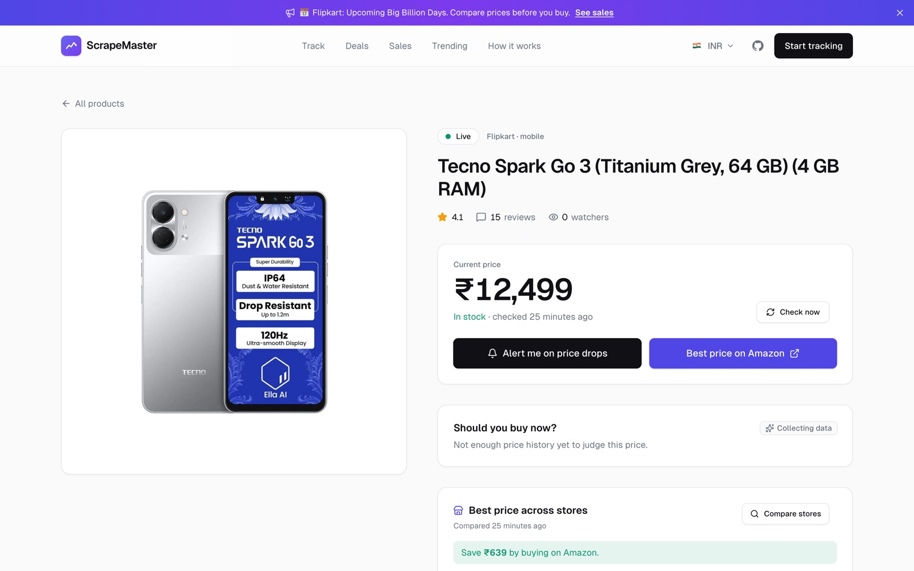
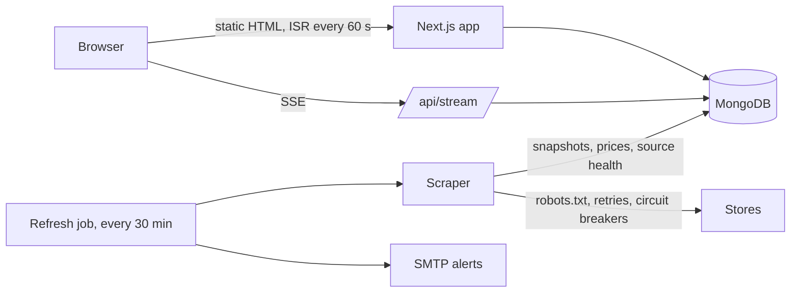

<div align="center">

# ScrapeMaster

**Real-time price tracking and comparison across online stores.**

Search a product or paste a link from any store. ScrapeMaster reads live prices from Amazon, Flipkart and any site that publishes product data, shows where it's cheapest, records price history, and emails you when it drops.

[](https://github.com/sAchin-680/ScrapeMaster/actions/workflows/ci.yml)
[](https://github.com/sAchin-680/ScrapeMaster/actions/workflows/codeql.yml)


<br />



</div>

<table>
  <tr>
    <td width="50%"></td>
    <td width="50%"></td>
  </tr>
  <tr>
    <td align="center"><sub>Live store deals, with inflated MRPs filtered out</sub></td>
    <td align="center"><sub>Product page with the cheapest store and comparison</sub></td>
  </tr>
</table>

## Features

- **Live multi-store search.** Searches every store for your country in parallel, groups identical listings, and shows the best price.
- **Any store.** Dedicated adapters for Amazon and Flipkart. Any other shop works through its schema.org / OpenGraph product data.
- **Real-time updates.** Prices stream to open pages over Server-Sent Events. Stale products re-check in the background when viewed.
- **Price history and verdicts.** An interactive chart plus a "should you buy now?" score based on the product's own history.
- **Alerts.** Emails on new lows, big discounts or restocks, each with a one-click unsubscribe.
- **Deals and sales.** Live store discounts (skipping inflated MRPs), store bestsellers, and a sale radar that reads banners from store homepages.
- **Localized.** Choose country and currency, with prices converted using daily exchange rates. Defaults to India and INR.
- **Visible reliability.** Each store's success rate and last good refresh are shown on the home page and at [`/status`](app/status/page.tsx).
- **Responsible collection.** Follows robots.txt, identifies itself honestly, rate-limits per site and prefers official data feeds. See [`/bot`](app/bot/page.tsx).

## Architecture



Visitors never wait on a store. The home page is static and regenerated in the background at most once a minute, and store feeds are read from snapshots the refresh job writes. The job runs on GitHub Actions because stores block requests from hosting providers' IP ranges. Headless Chromium runs only in that job, never on a visitor's request.

| Layer     | Implementation                                                                                                                                              |
| --------- | ----------------------------------------------------------------------------------------------------------------------------------------------------------- |
| App       | Next.js 15 App Router, React 19, Server Components and Server Actions                                                                                       |
| Data      | MongoDB with Mongoose, capped embedded price history, and indexes for listing and streaming                                                                 |
| Scraping  | Store adapters (`lib/scraper/stores`), structured data extraction, SSRF guard, per-host throttling, and a headless browser for stores that block plain HTTP |
| Matching  | Token containment with spec-conflict penalties, accessory filtering and price sanity checks (`lib/scraper/match.ts`)                                        |
| Delivery  | Static home page with ISR, preferences applied in the browser, and a database pool reused across serverless invocations (`attachDatabasePool`)              |
| Real-time | SSE stream on an `updatedAt` cursor, resumable via `Last-Event-ID`, which works on any MongoDB deployment                                                   |
| UI        | Tailwind CSS design tokens with light and dark themes, Headless UI, and hand-built SVG charts                                                               |

## Reliability

Every store request goes through `loadAndParse` (`lib/scraper/load.ts`):

- **Retries** with exponential backoff and full jitter, only for transient errors (timeouts, rate limits, bot checks). A missing page or a robots.txt disallow is not retried.
- **Circuit breaker** per source, meaning a store plus a page type such as `amazon:product`. After three consecutive failures the source is paused for two hours, with ±10% jitter. A single trial request then decides whether it resumes.
- **Health records**: the last 50 outcomes per source are persisted between runs. They drive the status panel and the per-store summary the job prints, which also appears on the Actions run page.
- **Run outcome**: the job fails only when most stores failed or were paused. One blocked store keeps its last snapshot and is reported, rather than turning the job red.

## Responsible data collection

- **robots.txt** is fetched and followed for every host (`lib/scraper/robots.ts`, RFC 9309, cached for a day). Pages it disallows are never requested. For example, Flipkart's search pages are excluded, so Flipkart search uses the official Affiliate API when credentials are set.
- **Honest user agent**: requests carry `ScrapeMasterBot/1.0` and a link to [`/bot`](app/bot/page.tsx), which explains what is collected and how to opt out.
- **Rate limits**: at least 1.2 s between requests to the same host, a fixed number of products per run, and no proxies.

## Getting started

Requires Node.js 22+ and MongoDB. Chrome or Chromium is needed for the refresh job (Flipkart product pages and store homepages).

```bash
npm install
cp .env.example .env.local   # set MONGODB_URI at minimum
npm run db                   # optional: local MongoDB in ./.data
npm run dev                  # http://localhost:3000
```

Search for a product on the home page to start tracking. Run `npm run feeds:refresh` to fill deals, trending, sale banners and store health.

## Configuration

| Variable                                                         | Purpose                                                 |
| ---------------------------------------------------------------- | ------------------------------------------------------- |
| `MONGODB_URI`                                                    | Database connection (required)                          |
| `NEXT_PUBLIC_SITE_URL`                                           | Public URL for metadata and email links                 |
| `APP_SECRET`                                                     | Signs unsubscribe links (required in production)        |
| `CRON_SECRET`                                                    | Bearer token for `/api/cron`                            |
| `ADMIN_TOKEN`                                                    | Bearer token for `/api/admin/sales`                     |
| `CHROME_EXECUTABLE_PATH`                                         | Local Chrome/Chromium for browser-rendered stores       |
| `BROWSER_WS_ENDPOINT`                                            | Remote browser (e.g. Browserless) for serverless hosts  |
| `BROWSER_ON_REQUEST`                                             | Allow the web server itself to start a browser (Docker) |
| `SMTP_HOST` `SMTP_PORT` `SMTP_USER` `SMTP_PASSWORD` `EMAIL_FROM` | Alert email delivery                                    |
| `FLIPKART_AFFILIATE_ID` `FLIPKART_AFFILIATE_TOKEN`               | Flipkart search through its official Affiliate API      |

## API

| Endpoint                               | Auth                 | Description                          |
| -------------------------------------- | -------------------- | ------------------------------------ |
| `GET /api/stream?ids=`                 | Public               | SSE feed of product changes          |
| `GET /api/cron`                        | `Bearer CRON_SECRET` | Refresh all products and send alerts |
| `GET /api/health`                      | Public               | Database health check                |
| `GET · POST · DELETE /api/admin/sales` | `Bearer ADMIN_TOKEN` | Manage sale events                   |
| `POST /api/unsubscribe`                | Signed link          | One-click unsubscribe (RFC 8058)     |

## Scripts

`dev` · `build` · `start` · `lint` · `typecheck` · `test` · `test:coverage` · `format` · `db` · `feeds:refresh`

## Deployment

**Vercel.** Import the repo and set the variables above. The `Refresh store data` workflow (`.github/workflows/refresh.yml`) refreshes everything every 30 minutes; give it the `MONGODB_URI` secret, plus the SMTP secrets for alerts. `vercel.json` also schedules a daily `/api/cron` as a fallback. The `Deploy` workflow can deploy after CI once `VERCEL_TOKEN`, `VERCEL_ORG_ID` and `VERCEL_PROJECT_ID` are set as repository secrets.

**Docker.** `docker compose up -d --build` runs the app (with Chromium, enabled via `BROWSER_ON_REQUEST`), MongoDB and a refresh scheduler. Images are published to GHCR on every push to `main` and on version tags.

## Quality

CI runs formatting, lint, type checks, unit tests with coverage thresholds, a production build, and a Docker build with a container smoke test. CodeQL and Dependabot run on schedule.

## Legal

ScrapeMaster is not affiliated with any retailer. Store names and logos belong to their owners. Retailer terms may restrict automated access even where robots.txt allows it, so review them before operating a public deployment, and prefer official feeds where they exist. See [Privacy](app/privacy/page.tsx) and [Terms](app/terms/page.tsx).
