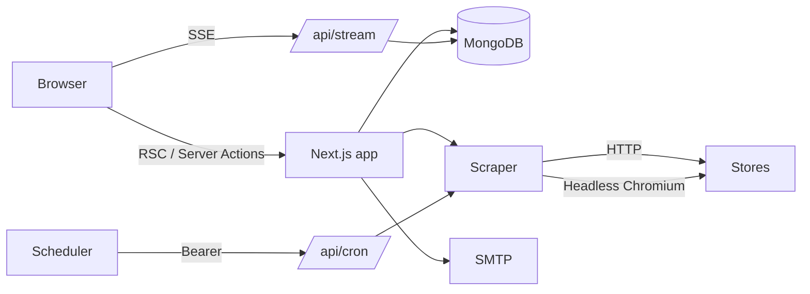

<div align="center">

# ScrapeMaster

**Real-time price tracking and comparison across online stores.**

Search a product or paste a link from any store. ScrapeMaster reads live prices from Amazon, Flipkart and any site that publishes product data, shows where it's cheapest, records price history, and emails you when it drops.

[](https://github.com/sAchin-680/ScrapeMaster-AI/actions/workflows/ci.yml)
[](https://github.com/sAchin-680/ScrapeMaster-AI/actions/workflows/codeql.yml)


<br />


</div>

<table>
  <tr>
    <td width="50%"></td>
    <td width="50%"></td>
  </tr>
  <tr>
    <td align="center"><sub>Live store deals, with inflated MRPs filtered out</sub></td>
    <td align="center"><sub>Product page with the cheapest store and comparison</sub></td>
  </tr>
</table>

## Features

- **Live multi-store search.** Searches every store for your country in parallel, groups identical listings, and shows the best price.
- **Any store.** Dedicated adapters for Amazon and Flipkart. Any other shop works through its schema.org / OpenGraph product data.
- **Real-time updates.** Prices stream to open pages over Server-Sent Events. Stale products re-check in the background when viewed.
- **Price history and verdicts.** An interactive chart plus a "should you buy now?" score based on the product's own history.
- **Alerts.** Emails on new lows, big discounts or restocks, each with a one-click unsubscribe.
- **Deals and sales.** Live store discounts (skipping inflated MRPs), store bestsellers, and a sale radar that reads banners from store homepages.
- **Localized.** Choose country and currency, with prices converted using daily exchange rates. Defaults to India and INR.

## Architecture



| Layer     | Implementation                                                                                                                                              |
| --------- | ----------------------------------------------------------------------------------------------------------------------------------------------------------- |
| App       | Next.js 15 App Router, React 19, Server Components and Server Actions                                                                                       |
| Data      | MongoDB with Mongoose, capped embedded price history, and indexes for listing and streaming                                                                 |
| Scraping  | Store adapters (`lib/scraper/stores`), structured data extraction, SSRF guard, per-host throttling, and a headless browser for stores that block plain HTTP |
| Matching  | Token containment with spec-conflict penalties, accessory filtering and price sanity checks (`lib/scraper/match.ts`)                                        |
| Real-time | SSE stream on an `updatedAt` cursor, resumable via `Last-Event-ID`, which works on any MongoDB deployment                                                   |
| UI        | Tailwind CSS design tokens with light and dark themes, Headless UI, and hand-built SVG charts                                                               |

## Getting started

Requires Node.js 22+, MongoDB, and Chrome or Chromium (used for Flipkart).

```bash
npm install
cp .env.example .env.local   # set MONGODB_URI at minimum
npm run db                   # optional: local MongoDB in ./.data
npm run dev                  # http://localhost:3000
```

Search for a product on the home page to start tracking.

## Configuration

| Variable                                                         | Purpose                                                |
| ---------------------------------------------------------------- | ------------------------------------------------------ |
| `MONGODB_URI`                                                    | Database connection (required)                         |
| `NEXT_PUBLIC_SITE_URL`                                           | Public URL for metadata and email links                |
| `APP_SECRET`                                                     | Signs unsubscribe links (required in production)       |
| `CRON_SECRET`                                                    | Bearer token for `/api/cron`                           |
| `ADMIN_TOKEN`                                                    | Bearer token for `/api/admin/sales`                    |
| `CHROME_EXECUTABLE_PATH`                                         | Local Chrome/Chromium for browser-rendered stores      |
| `BROWSER_WS_ENDPOINT`                                            | Remote browser (e.g. Browserless) for serverless hosts |
| `SMTP_HOST` `SMTP_PORT` `SMTP_USER` `SMTP_PASSWORD` `EMAIL_FROM` | Alert email delivery                                   |
| `BRIGHTDATA_USERNAME` `BRIGHTDATA_PASSWORD`                      | Optional rotating proxy                                |

## API

| Endpoint                               | Auth                 | Description                          |
| -------------------------------------- | -------------------- | ------------------------------------ |
| `GET /api/stream?ids=`                 | Public               | SSE feed of product changes          |
| `GET /api/cron`                        | `Bearer CRON_SECRET` | Refresh all products and send alerts |
| `GET /api/health`                      | Public               | Database health check                |
| `GET · POST · DELETE /api/admin/sales` | `Bearer ADMIN_TOKEN` | Manage sale events                   |
| `POST /api/unsubscribe`                | Signed link          | One-click unsubscribe (RFC 8058)     |

## Scripts

`dev` · `build` · `start` · `lint` · `typecheck` · `test` · `test:coverage` · `format` · `db`

## Deployment

**Vercel.** Import the repo and set the variables above. `vercel.json` schedules a daily refresh (the Hobby plan limit). Flipkart needs `BROWSER_WS_ENDPOINT`, because serverless functions cannot bundle Chromium. The `Deploy` workflow can deploy after CI once `VERCEL_TOKEN`, `VERCEL_ORG_ID` and `VERCEL_PROJECT_ID` are set as repository secrets.

**Docker.** `docker compose up -d --build` runs the app (with Chromium), MongoDB and a refresh scheduler. Images are published to GHCR on every push to `main` and on version tags.

## Quality

CI runs formatting, lint, type checks, unit tests with coverage thresholds, a production build, and a Docker build with a container smoke test. CodeQL and Dependabot run on schedule.

## Legal

ScrapeMaster is not affiliated with any retailer. Store names and logos belong to their owners. Retailer terms may restrict automated access, so review them before operating a public deployment. See [Privacy](app/privacy/page.tsx) and [Terms](app/terms/page.tsx).
