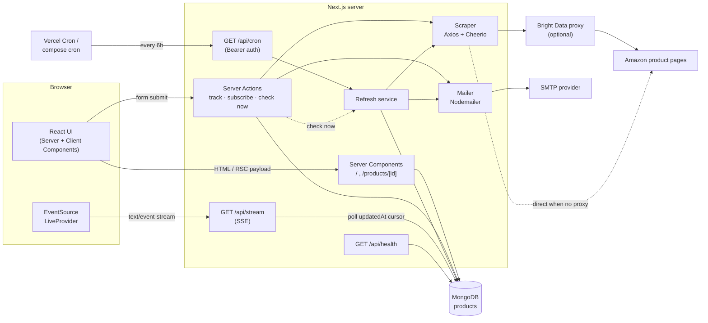
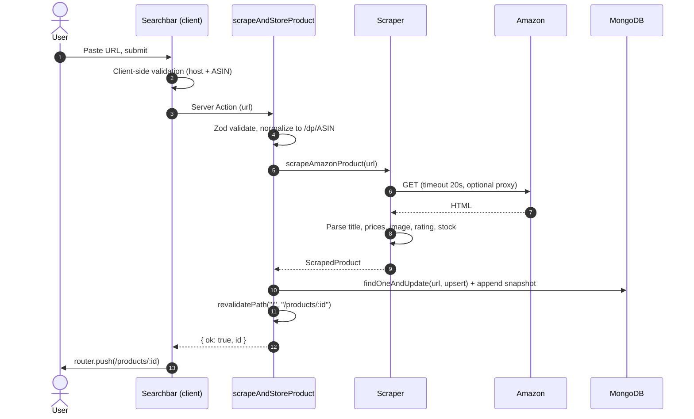
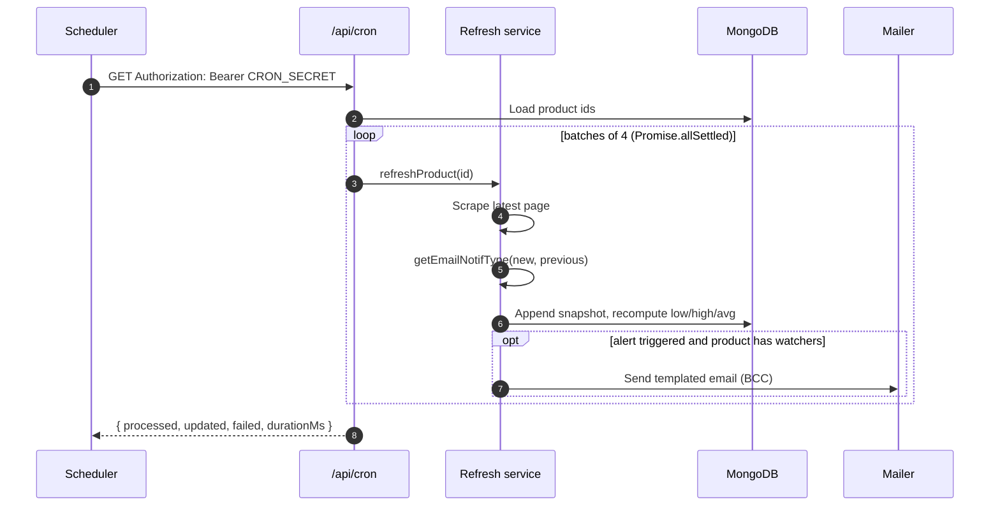
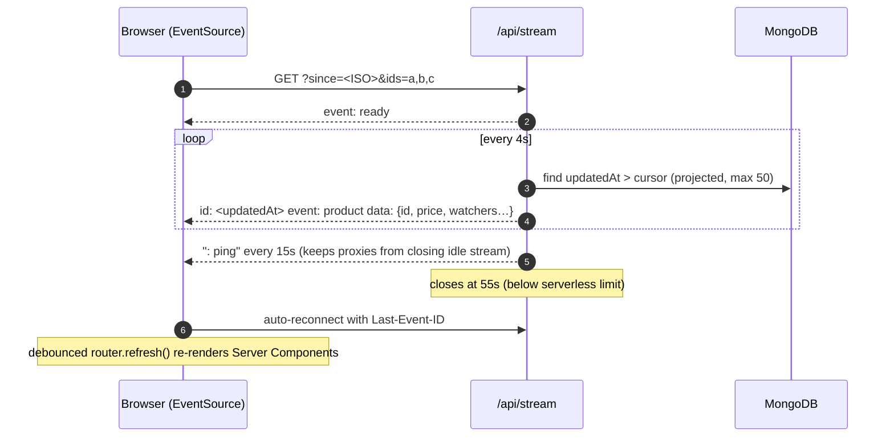
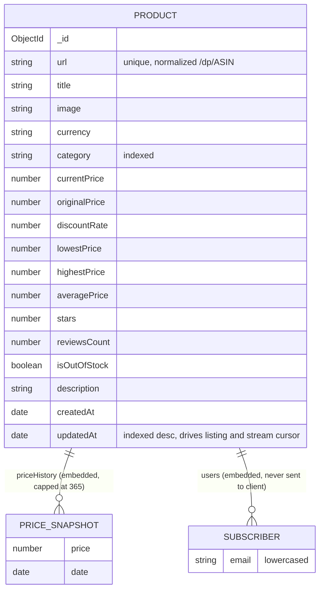

<div align="center">

# ScrapeMaster

**Real-time Amazon price tracker with full price history, live updates and drop alerts.**

Paste any Amazon product link → see every price we have recorded → watch changes stream in live → get one clean email when it hits a new low.

[](https://github.com/sAchin-680/ScrapeMaster-AI/actions/workflows/ci.yml)


</div>

---

## Table of contents

- [Features](#features)
- [Tech stack](#tech-stack)
- [System design](#system-design)
  - [High-level architecture](#high-level-architecture)
  - [Core flows](#core-flows)
  - [Real-time delivery](#real-time-delivery)
  - [Data model](#data-model)
  - [Alert rules](#alert-rules)
  - [Design decisions and trade-offs](#design-decisions-and-trade-offs)
  - [Scaling path](#scaling-path)
- [API reference](#api-reference)
- [Project structure](#project-structure)
- [Getting started](#getting-started)
- [Environment variables](#environment-variables)
- [Scripts](#scripts)
- [Testing](#testing)
- [Deployment](#deployment)
- [Security](#security)
- [Performance](#performance)
- [Accessibility](#accessibility)
- [Roadmap](#roadmap)

---

## Features

|                         |                                                                                                                                                |
| ----------------------- | ---------------------------------------------------------------------------------------------------------------------------------------------- |
| **One-paste tracking**  | Paste any Amazon URL (`.com`, `.in`, `.co.uk`, `.de`, …). It is normalized to its `/dp/<ASIN>` form so the same product is never stored twice. |
| **Price history chart** | Interactive, scrubbable SVG chart with lowest-price marker. No chart library, zero extra JS weight.                                            |
| **Live updates**        | Prices stream to every open page over Server-Sent Events. Changed prices flash green/red, timestamps tick, watcher counts update in place.     |
| **Check now**           | Re-scrape a product on demand, rate-limited to once per minute per product.                                                                    |
| **Email alerts**        | New all-time low, 40%+ discount, or back in stock. Sent via BCC so subscribers never see each other.                                           |
| **Scheduled refresh**   | A protected cron endpoint re-checks every product in bounded batches and tolerates partial failures.                                           |
| **Production ready**    | Typed env validation, security headers, health checks, standalone Docker image, CI pipeline, unit tests.                                       |
| **Polished UI**         | Light and dark themes, skeleton loading, error and 404 states, mobile bottom-sheet dialogs, reduced-motion support.                            |

---

## Tech stack

| Layer      | Choice                                                                | Why                                                                                                           |
| ---------- | --------------------------------------------------------------------- | ------------------------------------------------------------------------------------------------------------- |
| Framework  | **Next.js 15 (App Router)**                                           | Server Components for data-heavy pages, Server Actions for mutations, Route Handlers for the stream and cron. |
| UI         | **React 19**, **Tailwind CSS 3**, **Headless UI 2**, **lucide-react** | Accessible primitives, token-based theming, tree-shaken icons.                                                |
| Language   | **TypeScript (strict)**                                               | End-to-end types from the Mongoose schema to components.                                                      |
| Validation | **Zod**                                                               | Environment variables and every Server Action input.                                                          |
| Database   | **MongoDB + Mongoose 8**                                              | Product documents with embedded price history fit the document model naturally.                               |
| Scraping   | **Axios + Cheerio**, optional **Bright Data** proxy                   | Lightweight HTML fetch and parse; the proxy is opt-in for rotating residential IPs.                           |
| Email      | **Nodemailer** (any SMTP provider)                                    | Pooled transport, inline-styled responsive templates.                                                         |
| Testing    | **Vitest**                                                            | Fast unit tests for parsing, pricing, alerts and chart geometry.                                              |
| Delivery   | **Vercel** or **Docker**                                              | Vercel Cron out of the box; the standalone image runs anywhere.                                               |

---

## System design

### High-level architecture



**Boundaries**

- **Read path** (`lib/data`) runs only in Server Components. It uses `.lean()` queries, strips subscriber emails, and is wrapped in React `cache()` so metadata and page rendering share one query.
- **Write path** (`lib/actions`) is the only code that mutates data from user input. Every action validates with Zod and returns a typed `ActionResult` instead of throwing across the network boundary.
- **Refresh service** (`lib/services/refresh.ts`) is the single place that turns a scrape into a stored snapshot plus alerts. Both the cron job and "Check now" call it.
- **Server-only modules** import `server-only`, so credentials, the scraper and the mailer can never be bundled into client JavaScript.

### Core flows

#### 1. Tracking a new product



#### 2. Scheduled refresh and alerts



One failing product never aborts the run. Failures are logged and counted in the response.

### Real-time delivery



**Why SSE and cursor polling instead of WebSockets or change streams?**

- **SSE** is one-directional, which is all a price feed needs. It works over plain HTTP/2, reconnects automatically, and supports resume through `Last-Event-ID`, with no extra infrastructure.
- **Cursor polling** on an indexed `updatedAt` field works on every MongoDB deployment, including standalone instances without a replica set. MongoDB change streams require a replica set and a long-lived connection that serverless platforms do not keep.
- **Bounded stream lifetime** (55s) fits inside serverless execution limits. Reconnection is seamless because the cursor is carried in the event id.
- **Tab awareness:** hidden tabs close their stream and refresh when they become visible again, so idle tabs don't hold connections.

Client pieces live in `components/live/`: `LiveProvider` owns the connection, and `LivePrice`, `LiveBadge`, `LiveWatchers` and `RelativeTime` read from it.

### Data model



- History is **embedded** because it is always read together with its product and is bounded (`MAX_HISTORY_ENTRIES = 365`), which keeps documents well under MongoDB's 16 MB limit.
- Aggregates (`lowest/highest/average`) are **denormalized** on write so listing pages never scan history arrays.

### Alert rules

Evaluated in `lib/notifications.ts` by comparing the fresh scrape with the stored state:

| Priority | Type              | Fires when                                                                   |
| -------- | ----------------- | ---------------------------------------------------------------------------- |
| 1        | `LOWEST_PRICE`    | New price is below every recorded price (and is not a failed `0` read).      |
| 2        | `CHANGE_OF_STOCK` | Product was out of stock and is now available.                               |
| 3        | `THRESHOLD_MET`   | Discount **crosses** 40%. It fires once on the transition, not on every run. |
| –        | `WELCOME`         | Sent immediately when someone subscribes.                                    |

### Design decisions and trade-offs

| Decision                            | Alternative        | Reasoning                                                                                   |
| ----------------------------------- | ------------------ | ------------------------------------------------------------------------------------------- |
| Server Actions for mutations        | REST endpoints     | Type-safe calls with no client fetch layer; progressive enhancement.                        |
| Dynamic rendering for product pages | ISR                | Prices are the product; stale HTML defeats the purpose. Queries are indexed and lean.       |
| Hand-built SVG charts               | Chart library      | Saves roughly 60–100 KB of client JS; full control over styling and a11y.                   |
| URL normalization to ASIN           | Store raw URL      | Prevents duplicates from referral/tracking params.                                          |
| Typed `ActionResult`                | Throwing errors    | Server errors are sanitized in production; explicit results give users actionable messages. |
| BCC alert delivery                  | One email per user | One SMTP call per event, and subscriber privacy is preserved.                               |

### Scaling path

The current design comfortably serves thousands of tracked products on a single MongoDB instance. Beyond that:

1. **Queue the refresh.** Move `refreshProduct` onto a job queue (e.g. BullMQ/Redis, SQS) with per-domain rate limiting and retries with backoff, and let cron only enqueue.
2. **Prioritize by demand.** Refresh products with watchers or recent views more often than cold ones.
3. **Fan-out via pub/sub.** Replace per-connection polling with Redis pub/sub or MongoDB change streams on a replica set, so the database is polled once regardless of viewer count.
4. **Split history.** Move snapshots to a time-series collection once per-product history needs to exceed a year.
5. **Edge caching.** Cache the home listing for a few seconds at the CDN, since live updates already cover freshness.

---

## API reference

| Method | Path                                  | Auth                                 | Description                                                                            |
| ------ | ------------------------------------- | ------------------------------------ | -------------------------------------------------------------------------------------- |
| `GET`  | `/api/stream?since=<ISO>&ids=<id,id>` | Public                               | SSE feed of product changes. `ids` is optional (max 50). Resumes from `Last-Event-ID`. |
| `GET`  | `/api/cron`                           | `Authorization: Bearer $CRON_SECRET` | Refreshes all products. Returns `{ processed, updated, failed, durationMs }`.          |
| `GET`  | `/api/health`                         | Public                               | `200 {status:"ok"}` when MongoDB responds to ping, otherwise `503`.                    |

**Server Actions** (`lib/actions/index.ts`)

| Action                  | Input             | Result                                           |
| ----------------------- | ----------------- | ------------------------------------------------ |
| `scrapeAndStoreProduct` | Amazon URL        | `{ id }` of the created or updated product       |
| `addUserEmailToProduct` | product id, email | `{ alreadyTracking }` and sends a welcome email  |
| `refreshProductNow`     | product id        | `{ changed }`, rate-limited to 1/min per product |

**SSE event payload**

```json
{
  "id": "66f0c1…",
  "currentPrice": 248,
  "currency": "$",
  "isOutOfStock": false,
  "watchers": 12,
  "updatedAt": "2026-09-30T09:00:07.039Z"
}
```

---

## Project structure

```
.
├── app/
│   ├── api/
│   │   ├── cron/route.ts         # Protected scheduled refresh
│   │   ├── health/route.ts       # Liveness + DB ping
│   │   └── stream/route.ts       # Server-Sent Events price feed
│   ├── products/[id]/            # Product page + skeleton
│   ├── error.tsx · not-found.tsx · loading.tsx
│   ├── layout.tsx · page.tsx     # Shell and home page
│   ├── opengraph-image.tsx       # Generated social card
│   └── robots.ts · sitemap.ts
├── components/
│   ├── live/                     # LiveProvider, LivePrice, LiveBadge, RefreshButton…
│   ├── ui/                       # Logo, Sparkline, StatTile
│   └── *.tsx                     # Navbar, Searchbar, ProductCard, PriceChart, TrackModal…
├── lib/
│   ├── actions/                  # Server Actions (validated writes)
│   ├── data/                     # Server-only read queries
│   ├── db/                       # Cached Mongoose connection
│   ├── models/                   # Mongoose schemas
│   ├── nodemailer/               # Transport + HTML templates
│   ├── scraper/                  # Fetcher + pure HTML extractors
│   ├── services/                 # Refresh service shared by cron and actions
│   ├── utils/                    # price, format, url, chart, cn
│   ├── env.ts                    # Zod-validated environment
│   └── notifications.ts          # Alert decision rules
├── scripts/seed.mjs              # Demo data for local development
├── tests/                        # Vitest unit tests
├── Dockerfile · docker-compose.yml · vercel.json
└── .github/workflows/ci.yml
```

---

## Getting started

**Prerequisites:** Node.js 20+ and a MongoDB instance (local, Docker, or Atlas).

```bash
git clone https://github.com/sAchin-680/ScrapeMaster-AI.git
cd ScrapeMaster-AI
npm install

cp .env.example .env.local        # then fill in MONGODB_URI at minimum

npm run seed                      # optional: load demo products with history
npm run dev                       # http://localhost:3000
```

Quick local MongoDB with Docker:

```bash
docker run -d --name scrapemaster-mongo -p 27017:27017 mongo:7
# MONGODB_URI=mongodb://127.0.0.1:27017/scrapemaster
```

> Amazon frequently serves captchas to datacenter and residential IPs without rotation. For reliable scraping, set the Bright Data credentials. Without them, the scraper connects directly and reports a clear error when blocked.

---

## Environment variables

| Variable                                      | Required         | Description                                                              |
| --------------------------------------------- | ---------------- | ------------------------------------------------------------------------ |
| `MONGODB_URI`                                 | ✅               | MongoDB connection string.                                               |
| `NEXT_PUBLIC_SITE_URL`                        | Recommended      | Public base URL for metadata, sitemap and OG image.                      |
| `CRON_SECRET`                                 | ✅ in production | Bearer token for `/api/cron`. Without it, cron is refused in production. |
| `SMTP_HOST` / `SMTP_PORT`                     | For alerts       | SMTP server (port `465` uses TLS).                                       |
| `SMTP_USER` / `SMTP_PASSWORD`                 | For alerts       | SMTP credentials (e.g. a Gmail app password).                            |
| `EMAIL_FROM`                                  | Optional         | Sender, e.g. `ScrapeMaster <alerts@yourdomain.com>`.                     |
| `BRIGHTDATA_USERNAME` / `BRIGHTDATA_PASSWORD` | Optional         | Residential proxy for scraping.                                          |

All variables are validated at startup in `lib/env.ts`. When email is not configured, alerts are skipped with a warning instead of crashing.

---

## Scripts

| Command             | Description                                          |
| ------------------- | ---------------------------------------------------- |
| `npm run dev`       | Start the dev server.                                |
| `npm run build`     | Production build (standalone output).                |
| `npm start`         | Serve the production build.                          |
| `npm run lint`      | ESLint (Next.js core web vitals + TypeScript rules). |
| `npm run typecheck` | `tsc --noEmit`.                                      |
| `npm test`          | Run the Vitest suite.                                |
| `npm run format`    | Format with Prettier.                                |
| `npm run seed`      | Load demo products into `MONGODB_URI`.               |

---

## Testing

```bash
npm test
```

Unit tests cover the pure logic where regressions hurt most:

- **Scraper parsing:** localized price formats (`$1,299.99`, `₹54,999`, `1.299,00 €`), duplicated price nodes, full-page fixture extraction, and captcha detection.
- **URL handling:** accepted Amazon domains, look-alike hosts rejected, and ASIN normalization.
- **Pricing:** stats on empty history, percentage change, and the history cap.
- **Alerts:** each rule, including threshold de-duplication and ignoring failed `0` reads.
- **Chart geometry and formatting.**

CI runs lint, typecheck, tests, a production build and a Docker build on every push and pull request.

---

## Deployment

### Vercel (recommended)

1. Import the repository in Vercel.
2. Add the environment variables above, including `CRON_SECRET`.
3. Deploy. `vercel.json` registers `/api/cron` every 6 hours, and Vercel sends the `Authorization: Bearer $CRON_SECRET` header automatically.

> On the Hobby plan, Vercel Cron runs at most once per day. Change the schedule in `vercel.json` to `0 0 * * *`, or use an external scheduler.

### Docker

```bash
cp .env.example .env              # fill in values
docker compose up -d --build      # app + MongoDB + 6-hourly refresh trigger
```

The image is a multi-stage build on `node:22-alpine` using Next.js standalone output. It runs as a non-root user and has a built-in `HEALTHCHECK` against `/api/health`.

### Any Node host

```bash
npm ci && npm run build
node .next/standalone/server.js   # copy .next/static next to it
```

Point any scheduler (GitHub Actions, cron, Cloud Scheduler) at `GET /api/cron` with the bearer token.

---

## Security

- **Secrets** are only read from environment variables and validated at boot. Nothing is hard-coded.
- **Server-only boundary:** the scraper, mailer, DB and env modules import `server-only` and cannot leak into client bundles.
- **Input validation:** every Server Action validates with Zod. URLs must be real Amazon product hosts, so this is not an open proxy or SSRF vector.
- **Privacy:** subscriber emails are excluded from every read query and alerts go out via BCC.
- **Output encoding:** email templates HTML-escape scraped titles and URLs.
- **Headers:** HSTS, `X-Frame-Options: DENY`, `nosniff`, a strict referrer policy and a locked-down permissions policy. `X-Powered-By` is disabled.
- **Protected cron:** bearer-token auth. The endpoint is refused in production if no secret is set.
- **Abuse limits:** on-demand refresh is throttled per product, and stream subscriptions are capped at 50 ids.

---

## Performance

- Server Components render product data with no client fetch waterfall. Only interactive islands ship JavaScript.
- Home page first-load JS is about **116 KB**, including React.
- `.lean()` projections, indexes on `updatedAt` and `category`, denormalized aggregates, and history capped at 365 entries.
- A cached Mongoose connection promise survives hot reloads and warm serverless invocations.
- `next/image` with AVIF/WebP, responsive `sizes`, and priority loading for above-the-fold products.
- Local variable fonts (Geist, Geist Mono) with `display: swap`, so no third-party font requests.
- Live updates debounce `router.refresh()`, and background tabs disconnect.

---

## Accessibility

- Semantic landmarks, a skip link and visible `:focus-visible` rings.
- Headless UI dialog with focus trap, `Esc` to close and labelled title.
- `aria-live` regions for scrape progress, live status and refresh results.
- Chart exposes a text summary via `aria-label`, and inputs have explicit labels and `aria-invalid`.
- Honors `prefers-reduced-motion` and `prefers-color-scheme`.

---

## Roadmap

- [ ] User accounts with a personal watchlist and one-click unsubscribe links
- [ ] Target price alerts ("notify me below $X")
- [ ] Queue-based refresh workers with per-domain rate limiting
- [ ] More retailers behind a common scraper interface
- [ ] Web push notifications
- [ ] Playwright end-to-end tests

---

<div align="center">
Built by <a href="https://github.com/sAchin-680">@sAchin-680</a>. ScrapeMaster is not affiliated with Amazon.
</div>
